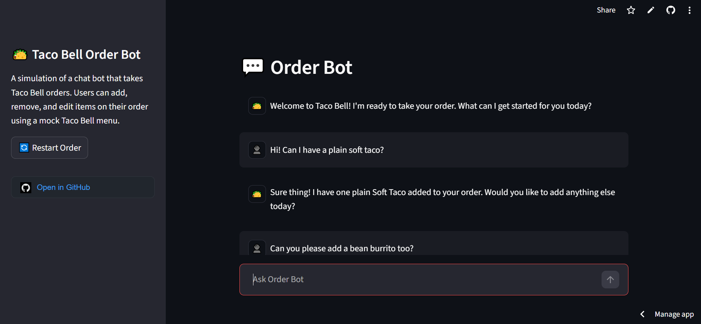

# Taco Bell Order Bot

A simulation of a chat bot that takes Taco Bell orders. Users can add, remove, and edit items on their order using a mock Taco Bell menu.

---

## A Look Inside

## Video Demo

---

## Features
* **Chat Bot:** Powered by Google's Gemini API to act like a real Taco Bell cashier.
* **Cart Management:** You can add, swap, or completely remove items, and the bot will update its internal memory.
* **Menu Integration:** The bot is tied to a mock Taco Bell menu.
* **Customizations & Sizes:** You can upgrade items (e.g., make it "Supreme") or specify sizes for drinks.
* **Automated Receipt:** Once ready to checkout, the bot calculates the total price and generates a clean, structured JSON receipt.

## Technologies
* **Programming Language:** Python
* **GUI Integration:** Streamlit
* **LLM:** Google Gemini (`gemini-3.1-flash-lite`)